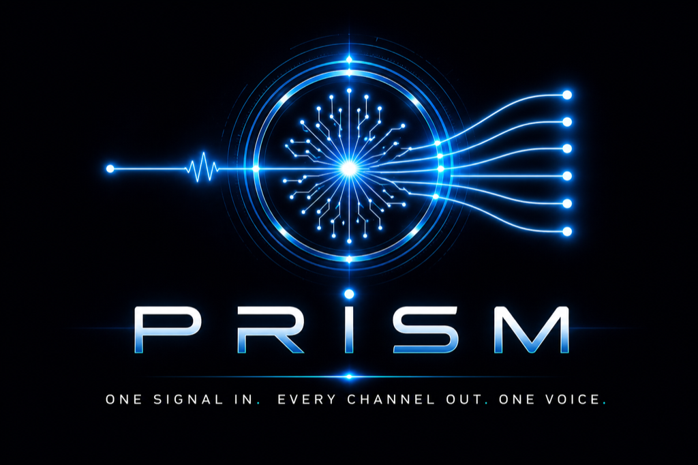

<p align="center">
  
</p>

<h3 align="center">One signal in. Every channel out. One voice.</h3>

<p align="center">
  <a href="https://cortexnode.ai">cortexnode.ai</a> ·
  <a href="https://bsky.app/profile/cortexnode.bsky.social">@cortexnode.bsky.social</a>
</p>

---

## What PRISM is

PRISM is the **reach** of [CORTEX](https://cortexnode.ai) — a sovereign publishing layer that takes a single source signal and refracts it into platform-tuned outputs across every channel where the audience lives.

A prism doesn't generate light. It refracts a single source into a spectrum, each output tuned to its wavelength. **That is the function captured in the name.**

This is not a fan-out tool. Fan-out sprays the same copy to many platforms. PRISM tunes each output to its medium — Bluesky receives a federated-builder slice; LinkedIn receives a long-form professional slice; X receives the punch slice; YouTube receives the script-and-thumbnail slice. Same source. Different wavelengths.

## Where PRISM sits in the family

| Subsystem | Role |
|---|---|
| **CORTEX** | The brain — memory, reasoning, presence, governance |
| **ADAM** | The voice — what the world hears CORTEX as |
| **PRISM** | The reach — how CORTEX speaks across channels |
| **S0** | The cursor — the builder seat |

Each subsystem is single-syllable, declarative, function-named.

## What PRISM does that fan-out tools can't

- **Audience routing** — keyword regex decides per-post which voice (cortex / b2tb / personal) and tunes the copy accordingly.
- **Locked attribution footer** — auto-injected per audience, so credit lines never drift.
- **Live proof-asset substitution** — `{{commits.total}}` becomes the actual commit count at publish time.
- **Calendar-aware scheduling** — picks the next 8a / 12p / 5p / 8p slot avoiding meetings.
- **Sovereign rails** — the operator owns the OAuth, the queue, the audit trail. Native API ownership across every adapter.
- **Honest fallback** — if a native adapter fails, a fallback wrapper picks up so no post silently drops.
- **Cutover audit** — a 90-day cutover monitor tracks native vs fallback delivery; the rented dependency graduates out the moment native rails prove themselves.

## The architecture, in three lines

```
Source signal  →  AudienceRouter  →  Footer + ProofAssets  →  CalendarAware  →  Queue
       ↓
  Six native adapters (Bluesky, FB, IG, Threads, LinkedIn, YouTube)
       ↓
  Each tuned to its medium · single voice across all
```

## Live now

- **Bluesky** — [@cortexnode.bsky.social](https://bsky.app/profile/cortexnode.bsky.social) · 4 inaugural posts on launch night
- **Facebook · Instagram · Threads · LinkedIn · YouTube** — adapters scaffolded · live the moment OAuth tokens land

## Status

PRISM was built and shipped on **2026-04-27**.

The cutover monitor runs daily, tracking the streak of native-only days. When the threshold is crossed, the footer evolves automatically — the rented dependency graduates out without a code change.

---

<p align="center">
  <sub>PRISM · refraction, not broadcast · Built by <a href="https://cortexnode.ai">CORTEXNODE Inc.</a></sub>
</p>
